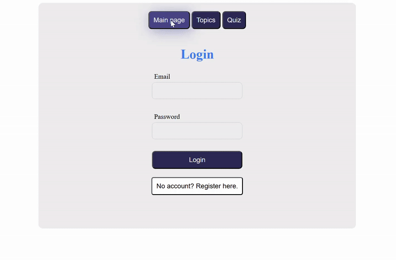

# 🧩 Quizzard – Drill & Practice App  

Quizzard is an application for **creating quizzes by topic** and **practicing random quizzes** from the database.  

---

## 🌍 Online Deployment
⚠️ The previously deployed version is no longer available due to expired free hosting.  

---

## 💻 Local Deployment (with Docker Compose)

The application runs locally using **Docker Compose**.

### ▶️ Starting the Application
1. Open a terminal in the folder containing the `docker-compose.yml` file  
   (e.g., right-click `wsd-walking-skeleton-main` → *Open in Integrated Terminal*).
2. Run:
   ```bash
   docker-compose up
   ```
   > ⏳ The first startup may take a while.
3. Once running, open [http://localhost:7777](http://localhost:7777) in your browser.
4. You can log in with the default admin account:  
   - **Email:** `admin@admin.com`  
   - **Password:** `123456`  
   Or register as a new user and log in with your own credentials.

### ⏹️ Stopping the Application
- In the same terminal where you ran `docker-compose up`, press **`Ctrl+C`**.  
- Alternatively, open a new terminal in the same folder and run:
  ```bash
  docker-compose stop
  ```

---

## 🧪 End-to-End Tests (Playwright)

To run E2E tests locally:

1. Ensure the application is running with Docker (see above).
2. From the project root (where `docker-compose.yml` is located), run:
   ```bash
   docker-compose run --entrypoint=npx e2e-playwright playwright test
   ```

---

## 🎥 Demo

Result preview:  




✅ Enjoy! 
-from miti with ❤️
